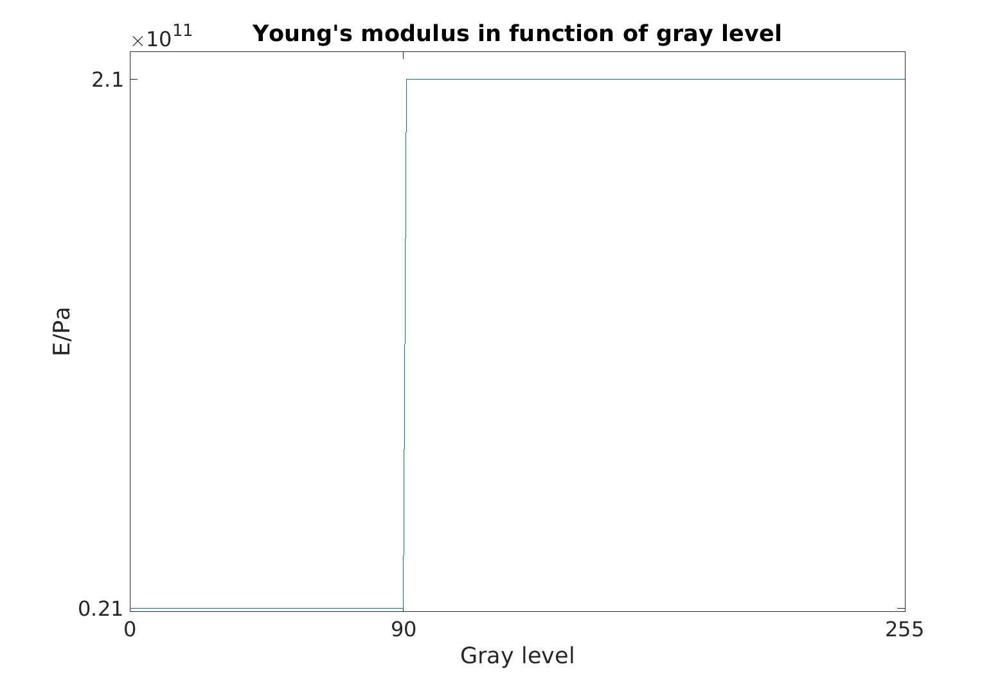
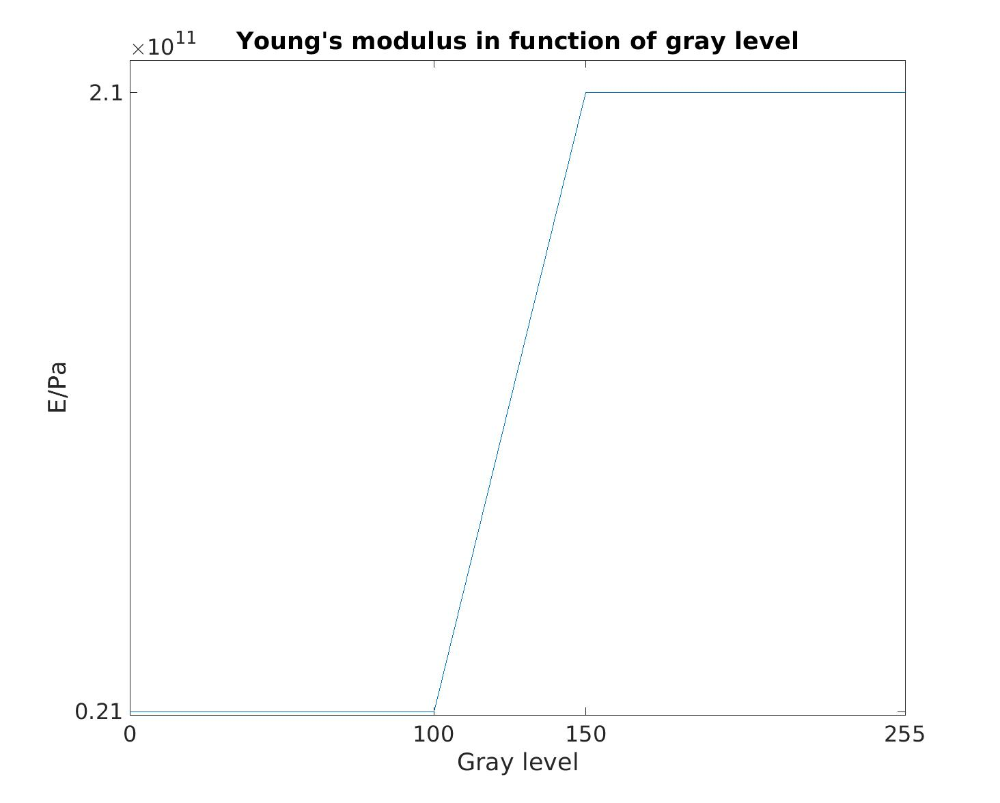

# Tutorial 
## Inputs
### 3D Image
HPCrack performs simulations from images, so an 3D image is need. An image in ".raw" format with gray level from 0 to 255 is required. 

### Material property
For material properties, user should put it in the file data/Material_property.csv, the different phases of material are corresponded to the gray level of image. *e.g.*, in the example image, there are two phases: matrix and inclusions. 
The gray level of inclusions is the part between 0 and 90, and these between 91 and 255 are matrix. 

| Gray level      | 0 | 90 | 91  |255 |
| :----:       |    :----:   |  :----:   |        :----: |  :----: |
| Young's modulus /E(Pa) | $2.1 \times 10^{10} $  | $2.1 \times 10^{10}$ | $2.1 \times 10^{11}$ |$2.1 \times 10^{11}$ |

If nothing is given between two gray levels, the linear interpolation is performed to obtain the material property as below : 

| Gray level      | 0 | 100 | 150  |255 |
| :----:       |    :----:   |  :----:   |        :----: |  :----: |
| Young's modulus /E(Pa) | $2.1 \times 10^{10} $  | $2.1 \times 10^{10}$ | $2.1 \times 10^{11}$ |$2.1 \times 10^{11}$ |

